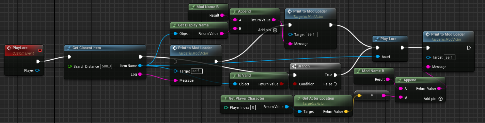
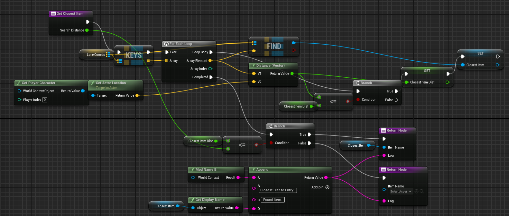

# RSDragonwilds Lore Narrator

# Overview
Tired of reading Lore Books? Want to know more about the story but reading all the books is so time intensive?? Time that you would rather spend logging trees??!! Then this Mod is for you. Just open the book, walk away and let the lore be poured into your ears while you squash some Kebbits and roast them over the fire.

The narration is based on a Text-To-Speech algorithm with open-source speeech samples used for voice cloning.

# Installation
- Install UE4SS (link in Requirements), Download the Mod
- Extract the contents of the archive to your RuneScape game installation directory (like "C:\Program Files (x86)\Steam\steamapps\common\RSDragonwilds").
- Launch the game and the mod will begin playing audio when opening a lore book.

# Features
- Audio Narration (Base Area) - Base area is covered
- Audio Narration (Fellhollow) - Some Lorebooks inside dungeons have not been narrated as of now
    Voices
   - MedievalSpeech (LoreNarratorMod_MedievalSpeech_Male_En_v1_1)
   - Asya Anara (LoreNarratorMod_AsyraAnara_Female_En_v1_1)

# Planned Features

- Audio queue management - Prevent overlapping audio playback when visiting multiple locations in quick succession or reopening books

# Possible Future Features

- More Languages - Mod in different languages
- More Voices - Adding more voice choices for narration
- Proximity Based Playing - Play the lore when being near to a lore book without opening it
- Configurable Settings - Play Distance, etc.
- Re-Play, Pause and Continue Shortcuts - In case you want to listen again
- UI-Indication that shows the time left talking (0 - 100%)

# Credits

- The narration has been done with coqui-ai-TTS
- The narration is based on voice clones from
   - MedievalSpeech.wav by tekgnosis -- https://freesound.org/s/144862/ -- License: Creative Commons 0
   - Asya Anara -- https://huggingface.co/coqui/XTTS-v2

# Project Overview

# ModActor

## LoreLib
